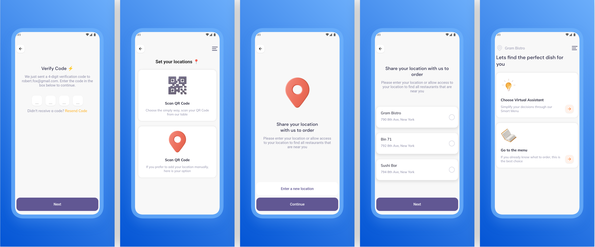

# eat_easy_app

A Flutter project as submission Sicoding Belajar Membuat Aplikasi Flutter untuk Pemula.

https://www.dicoding.com/academies/159

## Screenshot





## how to run

When you want to run this project on your computer firstly you should clone this repository on your computer

run this script to clone this project in your terminal

```bas
git clone https://github.com/mahmudph/eat_easy.git
```

After you have success to clone this repository, then open this project on your visual code or android studio.

download flutter sdk version **2.10.2** you can use this flutter version manager like fvm see this link for more detail https://fvm.app/

```bash
fvm use 2.10.2
```

do sync to download all dependencies which is being used in this project, or you can type

```bash
fvm flutter pub get
```

to run this project just type F5 or by run script

```
fvm flutter run
```
